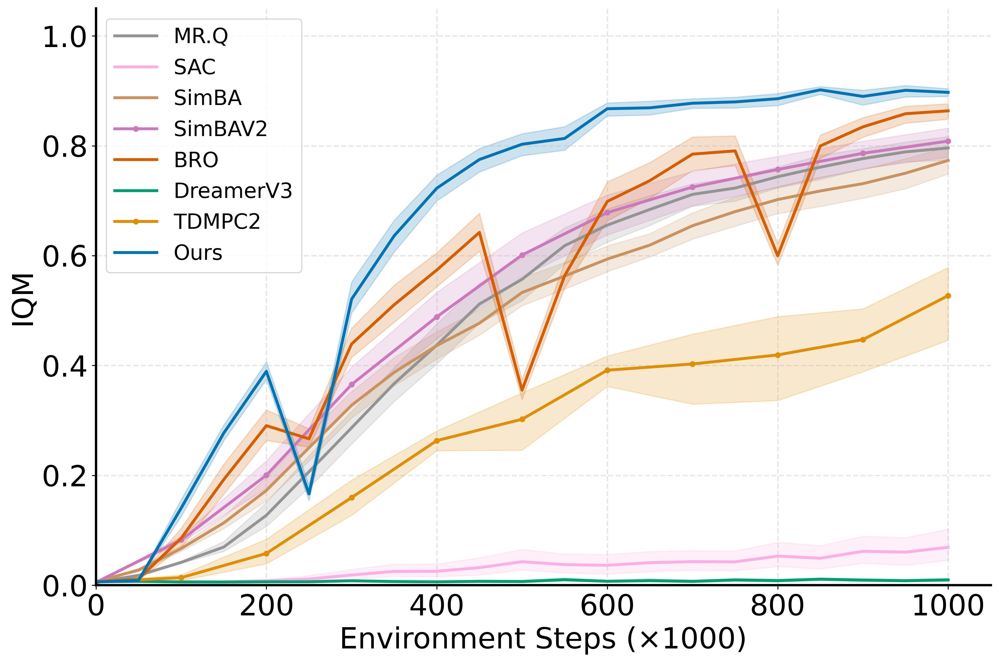
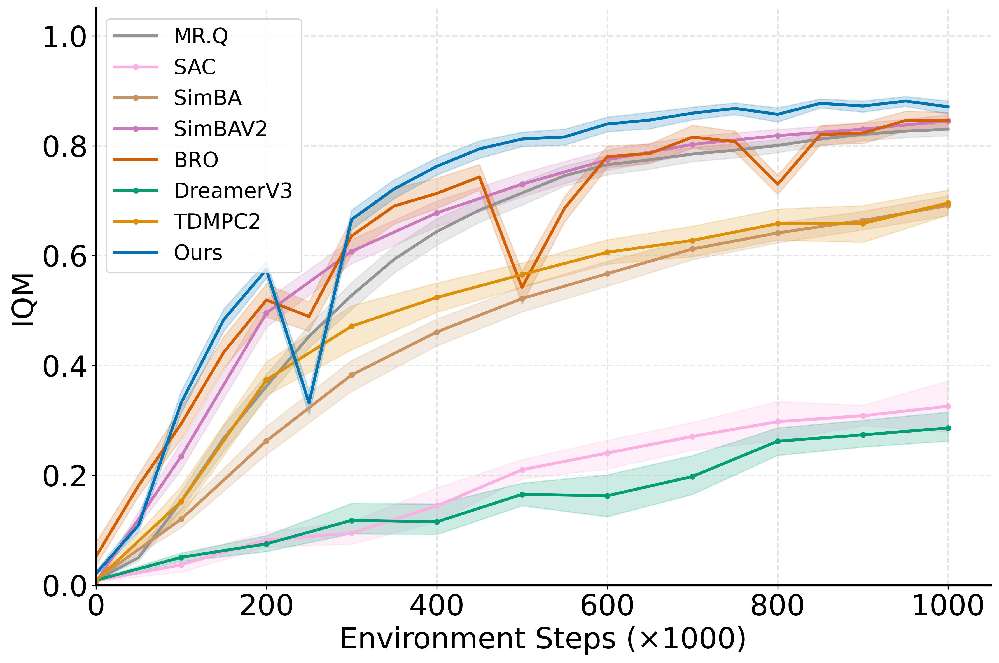
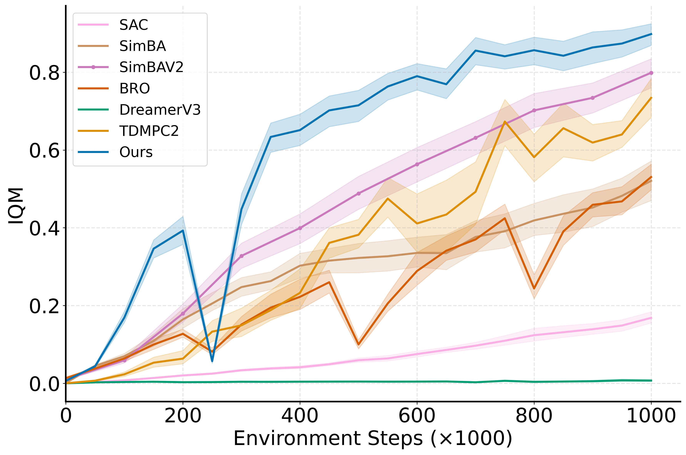
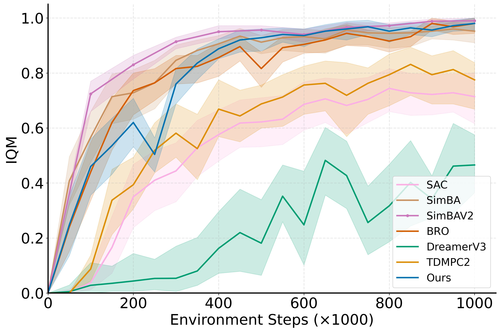

<h1 align="center">WIMLE: Uncertainty-Aware World Models with IMLE for Sample-Efficient Continuous Control</h1>

<div align="center">

<a href="https://openreview.net/forum?id=mzLOnTb3WH"></a>
<a href="https://www.linkedin.com/in/mehran-aghabozorg/"></a>
<a href="https://github.com/mehranagh20/wimle/stargazers"></a>

<br/><br/>

<table>
  <tr>
    <td align="center"></td>
    <td align="center"></td>
  </tr>
</table>

</div>

Official codebase for the ICLR 2026 paper: **WIMLE: Uncertainty-Aware World Models with IMLE for Sample-Efficient Continuous Control**.

**WIMLE** is a **model-based reinforcement learning** method: it learns stochastic, multi-modal world models and uses predictive uncertainty to emphasize the synthetic rollouts that matter most during training. Evaluated on 40 continuous-control benchmarks—DeepMind Control Suite, HumanoidBench, and MyoSuite—it substantially improves **sample efficiency** and **asymptotic performance**, with state-of-the-art results across the board.

<table width="100%">
  <tr>
    <td align="center" width="50%" valign="top">
      <b>DMC (Dog & Humanoid)</b><br/><br/>
      
    </td>
    <td align="center" width="50%" valign="top">
      <b>DMC (Full)</b><br/><br/>
      
    </td>
  </tr>
  <tr>
    <td align="center" width="50%" valign="top">
      <b>HumanoidBench</b><br/><br/>
      
    </td>
    <td align="center" width="50%" valign="top">
      <b>MyoSuite</b><br/><br/>
      
    </td>
  </tr>
</table>

*Note: Our implementation and codebase structure are heavily inspired by the [BiggerRegularizedOptimistic (BRO) codebase](https://github.com/naumix/BiggerRegularizedOptimistic).*

## Getting Started

This codebase uses isolated Python virtual environments. To avoid dependency conflicts and JAX/CUDA version mismatches (especially with `mujoco` and `dm_control`), we provide separate `requirements.txt` files for each task suite.

**Note on CUDA:** The requirements install a local pinned version of `nvidia-cuda-nvcc-cu12`. To allow JAX to compile using `ptxas` without a system-wide CUDA installation, simply run the following command in your terminal after activating the environment:
```bash
export PATH=$(python -c "import site; print(site.getsitepackages()[0] + '/nvidia/cuda_nvcc/bin')"):$PATH
```
### 1. Setup Virtual Environment
First, create and activate a fresh Python virtual environment. We recommend naming it `.test` as our scripts automatically look for it:

```bash
python -m venv .test
source .test/bin/activate
```

### 2. Install Dependencies

Depending on your target benchmark suite, run **one** of the following inside your active environment:

**For DeepMind Control Suite (DMC):**
```bash
pip install -r requirements_dmc.txt
```

**For HumanoidBench (HB):**
```bash
pip install -r requirements_hb.txt
```

**For MyoSuite (MYO):**
```bash
pip install -r requirements_myo.txt
```

## Training

You can easily launch training across any supported benchmark via the provided `scripts/train.sh` launcher. This script takes the benchmark and environment name as arguments, automatically parses the correct optimal rollout horizon ($H$) directly from the ICLR paper appendix, and handles invoking `train_parallel.py`!

```bash
# General Usage:
./scripts/train.sh <benchmark> <env_name>

# Running a HumanoidBench task (e.g., h1-maze-v0)
./scripts/train.sh hb h1-maze-v0

# Running a DMC task (e.g., humanoid-run)
./scripts/train.sh dmc humanoid-run

# Running a MyoSuite manipulation task (e.g., myo-key-turn-hard)
./scripts/train.sh myo myo-key-turn-hard
```

*(For a complete list of tested environment names, please refer to the configurations inside `scripts/train.sh`).*

Logs and metrics are recorded using Weights & Biases (`wandb`). By default, the `wandb_mode` in the launcher is set to `online` to automatically sync your runs to the W&B cloud!

## Reported results

The numbers reported in the paper are bundled under [`results/`](results/). Curves use **100** evaluation points at **10k** environment-step spacing (**1M** steps total per run).

- **`results/np_results/`** — Per-suite NumPy arrays (`dmc/`, `hb/`, `myo/`), one `.npy` file per environment (return curves; rows are seeds, columns are those 10k-step checkpoints).
- **`results/wimle.csv`** — All runs in a single long-form table (`exp_name`, `env_name`, `seed`, `metric`, `env_step`, `value`).
- **`results/wimle.pkl`** — Same data as a Python `dict` keyed by `env_name` (each value is the array for that task).

## Star History

[](https://star-history.com/#mehranagh20/wimle&Date)

## Citation

If you find this code or our paper useful in your research, please cite our work:

```bibtex
@inproceedings{aghabozorgi2026wimle,
    title={{WIMLE}: Uncertainty-Aware World Models with {IMLE} for Sample-Efficient Continuous Control},
    author={Mehran Aghabozorgi and Yanshu Zhang and Alireza Moazeni and Ke Li},
    booktitle={The Fourteenth International Conference on Learning Representations},
    year={2026},
    url={https://openreview.net/forum?id=mzLOnTb3WH}
}
```
